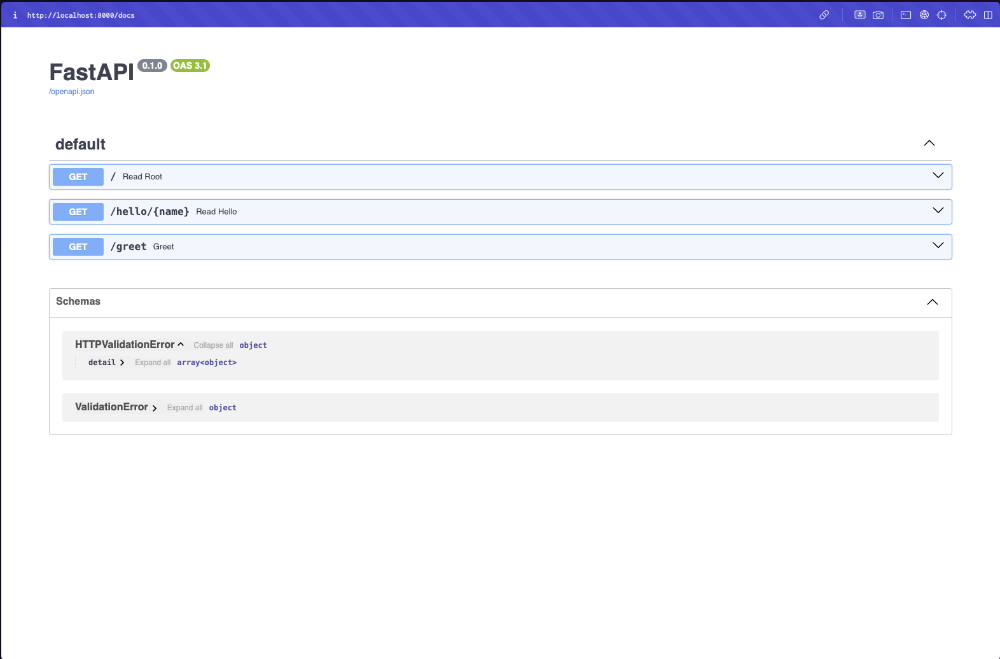
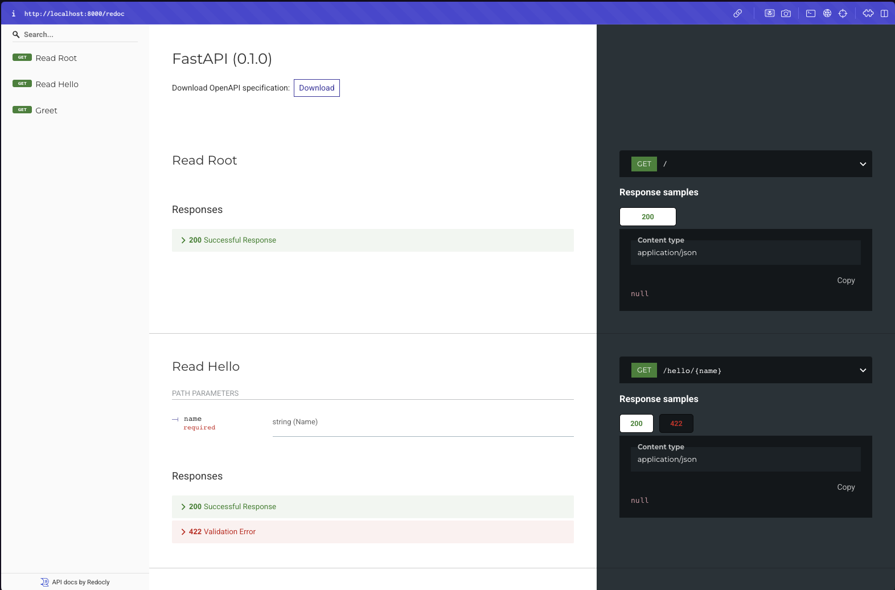

### Check if python is installed
```
$ python3 --version
Python 3.9.6
```

### Navigate to your project directory
```
$ pwd
/Users/sai/pov-fastapi

$ cd 0-get-started

$ pwd
/Users/sai/pov-fastapi/0-get-started
```

### Create a virtual environment called `myenv`
```
$ python3 -m venv myenv
```
* As a result of that
```
$ ls -la
total 0
drwxr-xr-x@ 3 sai  staff   96  3 Aug 21:37 .
drwxr-xr-x  4 sai  staff  128  3 Aug 21:35 ..
drwxr-xr-x@ 6 sai  staff  192  3 Aug 21:37 myenv

$ ls -la myenv 
total 8
drwxr-xr-x@  6 sai  staff  192  3 Aug 21:37 .
drwxr-xr-x@  3 sai  staff   96  3 Aug 21:37 ..
drwxr-xr-x@ 12 sai  staff  384  3 Aug 21:37 bin
drwxr-xr-x@  2 sai  staff   64  3 Aug 21:37 include
drwxr-xr-x@  3 sai  staff   96  3 Aug 21:37 lib
-rw-r--r--@  1 sai  staff  104  3 Aug 21:37 pyvenv.cfg
```

### Activate the virtual environment
* You'll see `(myenv)` at the beginning of your terminal prompt which is indicating the environment is active.
```
$ source myenv/bin/activate
(myenv)
```
* Run `pip3 list` to check the packages installed
```
$ pip3 list
Package    Version
---------- -------
pip        21.2.4
setuptools 58.0.4
WARNING: You are using pip version 21.2.4; however, version 25.2 is available.
You should consider upgrading via the '/Users/sai/pov-fastapi/0-get-started/myenv/bin/python3 -m pip install --upgrade pip' command.
```
* Upgrade your `pip` for your `myenv` as below:
```
$ pip install --upgrade pip
Requirement already satisfied: pip in ./myenv/lib/python3.9/site-packages (21.2.4)
Collecting pip
  Downloading pip-25.2-py3-none-any.whl (1.8 MB)
     |████████████████████████████████| 1.8 MB 10.2 MB/s 
Installing collected packages: pip
  Attempting uninstall: pip
    Found existing installation: pip 21.2.4
    Uninstalling pip-21.2.4:
      Successfully uninstalled pip-21.2.4
Successfully installed pip-25.2
```
* Verify your `pip3` version is upgraded
```
$ pip3 list
Package    Version
---------- -------
pip        25.2
setuptools 58.0.4
```

### Install `fastapi` package from your `myenv`
```
$ pip3 install fastapi
```
* Verify
```
$ pip3 list           
Package           Version
----------------- -------
annotated-types   0.7.0
anyio             4.9.0
exceptiongroup    1.3.0
fastapi           0.116.1
idna              3.10
pip               25.2
pydantic          2.11.7
pydantic_core     2.33.2
setuptools        58.0.4
sniffio           1.3.1
starlette         0.47.2
typing_extensions 4.14.1
typing-inspection 0.4.1
```

### Directory structure 
```
pov-fastapi/
├── .gitignore
├── README.md
└── 0-get-started/
    ├── myenv/          # your virtual environment
    └── src/
        └── main.py     # your main.py is here

```
* ### Install `uvicorn` package from your `myenv`
```
pip3 install uvicorn
```
```
$ pip3 list
Package           Version
----------------- -------
annotated-types   0.7.0
anyio             4.9.0
click             8.1.8
exceptiongroup    1.3.0
fastapi           0.116.1
h11               0.16.0
idna              3.10
pip               25.2
pydantic          2.11.7
pydantic_core     2.33.2
setuptools        58.0.4
sniffio           1.3.1
starlette         0.47.2
typing_extensions 4.14.1
typing-inspection 0.4.1
uvicorn           0.35.0
```
* Run `pip3 freeze > requirements.txt`
```
$ pip3 freeze > requirements.txt
```
* Directory structure will become
```
pov-fastapi/
├── .gitignore
├── README.md
└── 0-get-started/
    ├── myenv/          # your virtual environment
    ├── src/
    │   └── main.py     # your main.py is here
    └── requirements.txt
```

### Write your `main.py`

### Run your application as below
```
uvicorn src.main:app --reload
```
* You should see output like:
```
INFO:     Will watch for changes in these directories: ['/Users/sai/pov-fastapi/0-get-started']
INFO:     Uvicorn running on http://127.0.0.1:8000 (Press CTRL+C to quit)
INFO:     Started reloader process [31884] using StatReload
INFO:     Started server process [31886]
INFO:     Waiting for application startup.
INFO:     Application startup complete.
```
* Launch Terminal 2 to test your API. Try to understand the code while testing.
  1. Basic hello `curl http://localhost:8000`
    * Returns as below
      ```
      {"message":"Hello World"}
      ```
  2. Hello with name `curl http://localhost:8000/hello/Sai`
    * Returns as below
      ```
      {"message":"Hello Sai"}
      ```
  3. Greet with query parameter `curl "http://localhost:8000/greet?name=Tracy"`
    * Returns as below
      ```
      {"greeting":"Hello Tracy!"}
      ```
  4. Interactive API docs at `/docs` let you test your API directory in the browser.

  ### FastAPI Swagger UI
  


* The `/docs` endpoint serves Swagger UI, which is an interactive API documentation interface.

### Redoc
* FastAPI also provides `/redoc`. Visit `http://127.0.0.1:8000/redoc` for ReDoc, which is an alternative documentation interface that's more readable but less interactive.
  

### Raw OpenAPI JSON
* You can acces Raw OpenAPI JSON at `/openapi.json`. Visit `http://localhost:8000/openapi.json` in your browser.

* The OpenAPI schema is the source of truth that powers both `/docs` (Swagger UI) and `/redoc` interfaces.

### To stop the server
* Press `Ctrl+C` in the terminal where `uvicorn` is running.
* Your project structure should now look like:
```
pov-fastapi/
├── .gitignore
├── README.md
└── 0-get-started/
    ├── myenv/          # your virtual environment
    ├── src/
    │   └── main.py     # your main.py is here
    └── requirements.txt
```

### To deativate your python virtual environment
```
$ deactivate
```

### Congratulations !!!
* You now have a working FastAPI Hello World application.